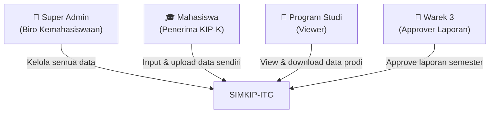
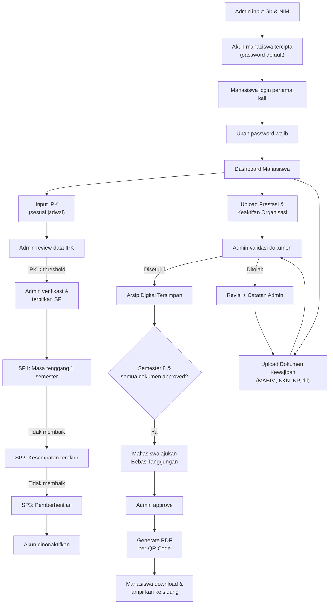

# Analisis Requirement & Prompt Visualisasi UI/UX
## Sistem Monitoring Mahasiswa KIP Kuliah — ITG (SIMKIP-ITG)

---

## BAGIAN A: RINGKASAN ANALISIS REQUIREMENT

### A.1 Kebutuhan Inti Sistem

Berdasarkan sintesis tiga dokumen sumber ([wawancara.txt](file:///c:/laragon/www/SIMKIP-ITG/wawancara.txt), [HLR](file:///c:/laragon/www/SIMKIP-ITG/HLR_Sistem_Monitoring_KIP_Kuliah_ITG.md), [SRS](file:///c:/laragon/www/SIMKIP-ITG/SRS_Sistem_Monitoring_KIP_Kuliah_ITG.md)), sistem ini adalah **platform monitoring terpusat** untuk mahasiswa penerima KIP Kuliah di ITG dengan fungsi utama:

| No | Kebutuhan Inti | Sumber |
|---|---|---|
| 1 | Pusat data terpusat (*single source of truth*) untuk seluruh data mahasiswa KIP-K | Wawancara, HLR §2.2 |
| 2 | Monitoring capaian akademik (IPK) per semester | HLR-F-05, SRS FR-2.1 |
| 3 | Monitoring prestasi & keaktifan organisasi | HLR-F-06/07, SRS FR-2.2 |
| 4 | Arsip digital dokumen kewajiban ("drive pribadi") | HLR-F-10/14, SRS FR-3.1/3.4 |
| 5 | Validasi dokumen oleh Admin | HLR-F-12, SRS FR-3.2/3.3 |
| 6 | Sistem Surat Peringatan (SP) berjenjang (SP1→SP2→SP3) | HLR-F-16–21, SRS FR-4.1–4.4 |
| 7 | Approval Bebas Tanggungan sebagai syarat sidang akhir | HLR-F-22–24, SRS FR-5.1–5.3 |
| 8 | Dashboard monitoring & pelaporan ke pimpinan | HLR-F-27–34, SRS FR-6.1–6.3 |
| 9 | Manajemen akun berbasis NIM & SK Penetapan KIP | HLR-F-01–04, SRS FR-1.1–1.3 |
| 10 | Ekspor laporan semester (Excel/PDF) dengan e-Signature | HLR-F-32–34, SRS FR-6.2–6.3 |

---

### A.2 Aktor Sistem & Hak Akses



| Aktor | Wewenang Utama | Batasan |
|---|---|---|
| **Super Admin** | Input SK & NIM, validasi dokumen, terbitkan SP, approve bebas tanggungan, hapus data (konfirmasi), kelola laporan, konfigurasi sistem | Akses penuh |
| **Mahasiswa** | Input IPK/prestasi/organisasi, upload dokumen, ajukan bebas tanggungan, lihat notifikasi SP, download arsip pribadi | Tidak bisa hapus data, akses hanya data sendiri |
| **Prodi** | Lihat dashboard & rekam jejak mahasiswa di prodinya, download laporan prodi | Read-only, tanpa validasi/approval |
| **Warek 3** | Approve laporan semester resmi (e-Signature/barcode) | Hanya modul pelaporan |

---

### A.3 Modul Sistem

| Modul | Kode HLR | Fitur Utama |
|---|---|---|
| **A. Autentikasi & Manajemen Akun** | HLR-F-01–04 | Login, ubah password, pembuatan akun, nonaktifkan akun |
| **B. Data Akademik & Non-Akademik** | HLR-F-05–09 | Input IPK, prestasi, organisasi, informasi pribadi |
| **C. Manajemen Dokumen & Kewajiban** | HLR-F-10–15 | Upload dokumen, validasi, arsip digital, konfigurasi jadwal |
| **D. Sistem Peringatan (SP)** | HLR-F-16–21 | SP berjenjang, notifikasi, masa tenggang, pemberhentian |
| **E. Approval & Kelulusan** | HLR-F-22–26 | Bebas tanggungan, generate PDF, view prodi |
| **F. Dashboard & Pelaporan** | HLR-F-27–34 | Dashboard statistik, ekspor Excel/PDF, approval laporan |
| **G. Data Historis & Migrasi** | HLR-F-35–36 | Import data lama (fase lanjutan) |
| **H. Konfigurasi Sistem** | HLR-F-37–39 | Pengaturan threshold, kalender, master data |

---

### A.4 User Flow Utama



---

### A.5 Business Rules Kunci

| Kode | Aturan | Dampak pada UI |
|---|---|---|
| BR-1 | Akun dibuat setelah Admin input NIM + SK | Form onboarding di admin panel |
| BR-2 | Password default wajib diganti | Force change password screen |
| BR-3 | SP berjenjang (SP1→SP2→SP3) | Panel notifikasi SP di dashboard mahasiswa |
| BR-4 | Cuti tanpa izin sakit = SP3 langsung | Alert khusus di penerbitan SP |
| BR-5 | Masa tenggang 1 semester per SP | Timer/indicator di detail SP |
| BR-6 | SP non-akademik diterbitkan manual | Form SP dengan dropdown alasan |
| BR-7 | Semua dokumen kewajiban wajib upload | Checklist progress di mahasiswa panel |
| BR-8 | Validasi satu per satu oleh Admin | Queue validasi di admin panel |
| BR-9 | Catatan penolakan opsional | Textarea opsional di form validasi |
| BR-10 | Jadwal input IPK mengikuti kalender akademik | Konfigurasi periode di admin settings |
| BR-11 | Hapus data hanya Admin + konfirmasi | Modal konfirmasi ganda |
| BR-12 | Approval bebas tanggungan wajib sebelum sidang | Workflow approval di admin |
| BR-13 | Batas studi 8 semester | Progress indicator semester |

---

## BAGIAN B: PEMETAAN HALAMAN SISTEM

### B.1 Daftar Lengkap Halaman

Berdasarkan analisis requirement di atas, berikut seluruh halaman yang dibutuhkan:

#### Halaman Umum (Shared)
| # | Halaman | Role |
|---|---|---|
| 1 | Login | Semua |
| 2 | Ubah Password (Force Change) | Mahasiswa (login pertama) |
| 3 | Profil & Pengaturan Akun | Semua |

#### Halaman Super Admin
| # | Halaman | Modul |
|---|---|---|
| 4 | Dashboard Admin | F — Dashboard |
| 5 | Manajemen Mahasiswa — Daftar | A — Manajemen Akun |
| 6 | Manajemen Mahasiswa — Tambah (Onboarding) | A — Manajemen Akun |
| 7 | Manajemen Mahasiswa — Detail Profil | B — Data Akademik |
| 8 | Manajemen Mahasiswa — Import Massal | G — Migrasi |
| 9 | Validasi Dokumen — Antrian | C — Manajemen Dokumen |
| 10 | Validasi Dokumen — Detail & Preview | C — Manajemen Dokumen |
| 11 | Input Akademik — Daftar IPK Mahasiswa | B — Data Akademik |
| 12 | Surat Peringatan — Daftar SP | D — Sistem Peringatan |
| 13 | Surat Peringatan — Terbitkan SP Baru | D — Sistem Peringatan |
| 14 | Surat Peringatan — Detail SP | D — Sistem Peringatan |
| 15 | Bebas Tanggungan — Daftar Permohonan | E — Approval |
| 16 | Bebas Tanggungan — Detail & Approve | E — Approval |
| 17 | Laporan Semester — Daftar | F — Pelaporan |
| 18 | Laporan Semester — Susun Laporan Baru | F — Pelaporan |
| 19 | Laporan Semester — Detail & Cetak | F — Pelaporan |
| 20 | Konfigurasi Sistem (Settings) | H — Konfigurasi |
| 21 | Audit Log | H — Konfigurasi |
| 22 | Manajemen Akun Prodi & Warek 3 | A — Manajemen Akun |
| 23 | Informasi Pribadi Mahasiswa (Catatan Admin) | B — Data Akademik |

#### Halaman Mahasiswa
| # | Halaman | Modul |
|---|---|---|
| 24 | Dashboard Mahasiswa | F — Dashboard |
| 25 | Input IPK Semester | B — Data Akademik |
| 26 | Riwayat Akademik (Grafik IPK) | B — Data Akademik |
| 27 | Input Prestasi | B — Data Akademik |
| 28 | Daftar Prestasi | B — Data Akademik |
| 29 | Input Keaktifan Organisasi | B — Data Akademik |
| 30 | Daftar Keaktifan Organisasi | B — Data Akademik |
| 31 | Upload Dokumen Kewajiban | C — Manajemen Dokumen |
| 32 | Arsip Digital (Drive Pribadi) | C — Manajemen Dokumen |
| 33 | Status Dokumen & Tracking | C — Manajemen Dokumen |
| 34 | Notifikasi Surat Peringatan | D — Sistem Peringatan |
| 35 | Ajukan Bebas Tanggungan | E — Approval |
| 36 | Status Bebas Tanggungan & Download PDF | E — Approval |

#### Halaman Prodi
| # | Halaman | Modul |
|---|---|---|
| 37 | Dashboard Prodi | F — Dashboard |
| 38 | Daftar Mahasiswa KIP di Prodi | E — View |
| 39 | Detail Rekam Jejak Mahasiswa (Read-only) | E — View |
| 40 | Ekspor Laporan Prodi | F — Pelaporan |

#### Halaman Warek 3
| # | Halaman | Modul |
|---|---|---|
| 41 | Dashboard Warek 3 | F — Dashboard |
| 42 | Daftar Laporan Menunggu Approval | F — Pelaporan |
| 43 | Detail Laporan & e-Signature | F — Pelaporan |

**Total: 43 halaman**

---

## BAGIAN C: PROMPT VISUALISASI UI/UX PER HALAMAN

> [!IMPORTANT]
> Setiap prompt di bawah dirancang untuk menghasilkan mockup/visualisasi UI/UX yang akurat dan konsisten dengan kebutuhan sistem SIMKIP-ITG. Prompt dapat digunakan langsung pada AI image generator atau design tool.

### Panduan Desain Umum (Design System)
- **Warna Primer**: Biru tua (#1E3A5F) — representasi institusi pendidikan formal
- **Warna Aksen**: Emas (#D4A843) — representasi keunggulan akademik
- **Warna Danger/SP**: Merah (#DC2626) — untuk alert dan surat peringatan
- **Warna Success**: Hijau (#059669) — untuk status approved/disetujui
- **Warna Warning**: Kuning (#D97706) — untuk status pending
- **Font**: Inter atau Outfit (Google Fonts)
- **Layout**: Sidebar navigation (desktop), bottom nav (mobile)
- **Design Style**: Clean modern dashboard, glassmorphism cards, subtle shadows

---

### HALAMAN 1: Login

**Prompt:**
```
Design a modern, premium login page for "SIMKIP-ITG" (Sistem Monitoring KIP Kuliah - Institut Teknologi Garut). 

PURPOSE: Authentication entry point for all users (Admin, Mahasiswa, Prodi, Warek 3).

LAYOUT:
- Split-screen layout on desktop: left side is a decorative hero panel, right side is the login form.
- Left panel: Dark blue (#1E3A5F) gradient background with subtle geometric patterns, ITG university logo at the center top, tagline "Sistem Monitoring Mahasiswa KIP Kuliah" in white, and an abstract illustration representing education/monitoring.
- Right panel: Clean white background with centered login form.

UI COMPONENTS:
- ITG logo (small) at top of form area
- Heading: "Masuk ke SIMKIP-ITG"
- Input field: "NIM / Username" with user icon prefix
- Input field: "Password" with lock icon prefix and show/hide toggle
- "Ingat Saya" checkbox
- Primary button: "Masuk" (full-width, blue #1E3A5F background, gold #D4A843 hover)
- Footer text: "© 2026 Institut Teknologi Garut"

STATES:
- Default (empty form)
- Error state: red border on invalid fields, error message "NIM atau password salah"
- Loading state: button shows spinner

RESPONSIVE:
- Mobile: single column, hero panel becomes a compact banner on top with logo only
- Tablet: same as mobile but form is wider
```

---

### HALAMAN 2: Ubah Password (Force Change)

**Prompt:**
```
Design a "Force Change Password" page for SIMKIP-ITG system.

PURPOSE: Mandatory password change screen shown to Mahasiswa (students) on their first login. The system generates a default password, and students must change it before accessing any features.

ROLE: Mahasiswa (first-time login)

LAYOUT:
- Centered card on a light gray background
- No sidebar navigation (user hasn't fully entered the system yet)
- Card width: ~480px max

UI COMPONENTS:
- Warning banner at top of card: yellow/amber background with shield icon, text: "Demi keamanan akun Anda, silakan ubah password default sebelum melanjutkan."
- Heading: "Ubah Password"
- Input: "Password Lama (Default)" — pre-filled or empty with lock icon
- Input: "Password Baru" — with strength indicator bar (weak/medium/strong) below
- Input: "Konfirmasi Password Baru" — with match/mismatch indicator
- Password requirements checklist (min 8 chars, uppercase, number) shown as small gray text that turns green when met
- Primary button: "Simpan & Lanjutkan" (blue)
- No skip or cancel option (mandatory)

DATA: None displayed — purely a form page.

INTERACTIONS:
- Real-time password strength meter
- Real-time match validation between new password and confirmation
- On success: redirect to Dashboard Mahasiswa with success toast notification

RESPONSIVE:
- Mobile: card becomes full-width with padding
- The form remains single column on all breakpoints
```

---

### HALAMAN 3: Profil & Pengaturan Akun

**Prompt:**
```
Design a "Profile & Account Settings" page for SIMKIP-ITG system.

PURPOSE: Allow all users to view their profile information and change their password.

ROLE: All roles (Super Admin, Mahasiswa, Prodi, Warek 3) — content adapts per role.

LAYOUT:
- Standard dashboard layout with left sidebar navigation
- Main content area with two sections stacked vertically

UI COMPONENTS:
Section 1 — "Informasi Profil" (read-only card):
- Avatar/initials circle (large, with role badge)
- For Mahasiswa: NIM, Nama, Program Studi, Angkatan, Kategori (Reguler/Aspirasi badge), Status Akun (Aktif — green badge)
- For Admin: Nama, Username, Role badge
- For Prodi: Nama Prodi, Username
- Non-editable fields shown in a clean two-column grid

Section 2 — "Ubah Password" (form card):
- Input: "Password Saat Ini"
- Input: "Password Baru" with strength indicator
- Input: "Konfirmasi Password Baru"
- Button: "Simpan Password" (blue)
- Cancel link

INTERACTIONS:
- Success toast notification on password change
- Validation errors shown inline

RESPONSIVE:
- Mobile: sections stack vertically, fields become single column
- Sidebar collapses to hamburger menu
```

---

### HALAMAN 4: Dashboard Admin (Super Admin)

**Prompt:**
```
Design a comprehensive Admin Dashboard for SIMKIP-ITG — the primary landing page for Super Admin (Biro Kemahasiswaan).

PURPOSE: Provide a bird's-eye view of all KIP-K student data for monitoring, evaluation, and audit readiness. This is the most important page — it must present data clearly for BPK/Inspektorat audit scenarios.

ROLE: Super Admin (Kemahasiswaan)

LAYOUT:
- Left sidebar with navigation menu (dark blue #1E3A5F background, gold accents)
- Top header bar with: user avatar, notification bell (with red badge count), and greeting "Selamat datang, Pak Encep"
- Main content area with grid of stat cards and charts

SIDEBAR NAVIGATION ITEMS:
- Dashboard (active, home icon)
- Manajemen Mahasiswa (users icon)
- Validasi Dokumen (file-check icon, with pending count badge)
- Surat Peringatan (alert-triangle icon)
- Bebas Tanggungan (award icon)
- Laporan Semester (bar-chart icon)
- Konfigurasi (settings icon)
- Audit Log (history icon)

UI COMPONENTS:
Row 1 — Summary Stat Cards (4 cards):
- Card 1: "Total Mahasiswa KIP Aktif" — large number "167", blue icon, subtle upward trend indicator
- Card 2: "Mahasiswa Reguler" — number "102", with percentage "61%", green accent
- Card 3: "Mahasiswa Aspirasi" — number "65", with percentage "39%", purple accent
- Card 4: "Dokumen Menunggu Validasi" — number "23", yellow warning accent, clickable to validasi page

Row 2 — Charts (2 columns):
- Left: Horizontal bar chart "Sebaran per Program Studi" showing 5 bars (Teknik Informatika, Teknik Industri, Teknik Sipil, Arsitektur, Sistem Informasi) with different colors and exact counts
- Right: Stacked bar chart "Sebaran per Angkatan" showing years (2022, 2023, 2024, 2025, 2026) with Reguler/Aspirasi segments

Row 3 — Action Tables (2 columns):
- Left: "Mahasiswa dengan SP Aktif" — compact table with columns: NIM, Nama, Prodi, Tingkat SP (SP1 red badge, SP2 darker red), Tanggal Terbit. Max 5 rows with "Lihat Semua →" link
- Right: "Permohonan Bebas Tanggungan Terbaru" — compact table with: NIM, Nama, Tanggal Ajukan, Status (Menunggu — yellow badge). Max 5 rows with "Lihat Semua →" link

Row 4 — Quick Stats:
- "Mahasiswa Semester ≥ 7 (Mendekati Batas)" — count with warning icon
- "Total SP Diterbitkan Semester Ini" — count
- "Laporan Semester Belum Di-Approve Warek 3" — count with link

DATA:
- Total mahasiswa KIP aktif, pembagian reguler vs aspirasi
- Sebaran per prodi (5 prodi: TI, TIn, TS, Arsitektur, SI)
- Sebaran per angkatan (2022–2026)
- Daftar SP aktif
- Permohonan bebas tanggungan pending
- Dokumen menunggu validasi

INTERACTIONS:
- All stat cards are clickable, navigating to respective detail pages
- Charts have hover tooltips showing exact numbers
- Notification bell dropdown shows recent activities (SP diterbitkan, dokumen diupload, permohonan masuk)
- Auto-refresh data every 5 minutes

STATES:
- Normal state with populated data
- Empty state for tables: "Tidak ada data" with relevant illustration

RESPONSIVE:
- Tablet: charts become full-width stacked
- Mobile: sidebar becomes hamburger, stat cards become 2-column grid, charts stack vertically, tables become scrollable horizontally
```

---

### HALAMAN 5: Manajemen Mahasiswa — Daftar

**Prompt:**
```
Design a "Student Management List" page for SIMKIP-ITG Admin panel.

PURPOSE: Display a searchable, filterable, paginated table of all KIP-K students registered in the system. Admin can view, edit, activate/deactivate, or delete student accounts from here.

ROLE: Super Admin

LAYOUT:
- Standard dashboard layout with left sidebar
- Page title "Manajemen Mahasiswa" with breadcrumb
- Filter bar + data table as main content

UI COMPONENTS:
Top Bar:
- Page heading: "Manajemen Mahasiswa"
- Primary button (top-right): "+ Tambah Mahasiswa" (blue) — links to onboarding form
- Secondary button: "Import Massal" (outline) — links to bulk import page

Filter/Search Bar:
- Search input: "Cari NIM atau Nama..."
- Dropdown filter: "Program Studi" (All / TI / TIn / TS / Arsitektur / SI)
- Dropdown filter: "Angkatan" (All / 2022 / 2023 / 2024 / 2025 / 2026)
- Dropdown filter: "Kategori" (All / Reguler / Aspirasi)
- Dropdown filter: "Status" (All / Aktif / Dicabut / Lulus)
- Reset filters link

Data Table:
- Columns: No | NIM | Nama | Prodi | Angkatan | Kategori (badge: blue=Reguler, purple=Aspirasi) | Status (badge: green=Aktif, red=Dicabut, gray=Lulus) | SP Aktif (badge count or "—") | Aksi
- Action column: dropdown menu with "Lihat Detail", "Nonaktifkan", "Hapus" (red text)
- Pagination at bottom (showing "1-20 dari 167 mahasiswa")
- Alternating row colors for readability

INTERACTIONS:
- Click row or "Lihat Detail" → navigate to student profile detail
- "Nonaktifkan" → confirmation modal "Apakah Anda yakin ingin menonaktifkan akun [NIM - Nama]? Mahasiswa tidak akan dapat login mulai semester berikutnya."
- "Hapus" → double confirmation modal (BR-11): first modal "Anda akan menghapus data [Nama]. Tindakan ini tidak dapat dibatalkan.", then input NIM to confirm
- Filters apply instantly (debounced search)
- Sort by clicking column headers (NIM, Nama, Angkatan)

RESPONSIVE:
- Mobile: table becomes card-based list view (each student = one card with key info)
- Filter bar stacks vertically
```

---

### HALAMAN 6: Manajemen Mahasiswa — Tambah (Onboarding)

**Prompt:**
```
Design a "Student Onboarding Form" page for SIMKIP-ITG Admin panel.

PURPOSE: Allow Super Admin to register a new KIP-K student by inputting their SK (Surat Keputusan) and NIM. Upon submission, the system auto-generates a student account with a default password.

ROLE: Super Admin

LAYOUT:
- Standard dashboard layout with sidebar
- Centered form card (max-width ~700px)
- Breadcrumb: Manajemen Mahasiswa > Tambah Mahasiswa

UI COMPONENTS:
Form Card with heading: "Registrasi Mahasiswa KIP-K Baru"

Section 1 — "Data SK Penetapan KIP":
- Input: "Nomor SK" (text, required) — with format hint
- Input: "Tanggal SK" (date picker, required)
- File upload: "Upload File SK" (PDF/image, max 5MB) with drag-and-drop area

Section 2 — "Data Mahasiswa":
- Input: "NIM" (text, required, unique validation)
- Input: "Nama Lengkap" (text, required)
- Dropdown: "Program Studi" (required, options: Teknik Informatika, Teknik Industri, Teknik Sipil, Arsitektur, Sistem Informasi)
- Dropdown: "Angkatan" (required, year selection)
- Radio buttons: "Kategori Kepesertaan" — Reguler | Aspirasi (with tooltip explaining the difference)

Section 3 — "Kredensial Akun" (read-only preview):
- Generated username: "[NIM]" — shown as disabled input
- Generated default password: "kip[NIM]2026" — shown as masked with reveal button
- Info text: "Password default akan diberikan kepada mahasiswa. Mahasiswa wajib mengubah password saat login pertama."

Footer:
- Primary button: "Simpan & Daftarkan" (blue)
- Secondary button: "Simpan & Tambah Lagi" (outline)
- Cancel link: "Batal"

INTERACTIONS:
- NIM uniqueness check on blur (shows green checkmark or red error)
- File upload shows preview thumbnail after selection
- On success: modal "Mahasiswa [Nama] berhasil didaftarkan! Kredensial akun: NIM: [NIM], Password Default: [password]" with "Cetak Kredensial" and "Tutup" buttons
- Form validation with inline error messages

RESPONSIVE:
- Mobile: form sections stack, file upload area adjusts
- All inputs become full-width on mobile
```

---

### HALAMAN 7: Manajemen Mahasiswa — Detail Profil

**Prompt:**
```
Design a comprehensive "Student Profile Detail" page for SIMKIP-ITG Admin panel.

PURPOSE: Show the complete record/track of a KIP-K student across all semesters — academic data, achievements, organization activities, uploaded documents, warning letters, and clearance status. This is the "360-degree view" of a student.

ROLE: Super Admin (full access), Prodi (read-only, limited view)

LAYOUT:
- Standard dashboard layout with sidebar
- Breadcrumb: Manajemen Mahasiswa > [NIM - Nama Mahasiswa]
- Tab-based content organization within main area

UI COMPONENTS:
Header Card (always visible):
- Student photo/avatar placeholder (large circle)
- Name, NIM, Prodi, Angkatan in a prominent layout
- Badge row: Kategori (Reguler/Aspirasi), Status Akun (Aktif/Nonaktif), SP status (if any: "SP1 Aktif" in red badge)
- Semester progress bar: "Semester 5 dari 8" — visual progress indicator showing how close to the 8-semester limit
- Quick action buttons (Admin only): "Terbitkan SP", "Nonaktifkan Akun"

Tabs:
1. **Riwayat Akademik**: 
   - Line chart showing IPK trend across semesters (semester 1–8 on x-axis, IPK 0–4.0 on y-axis)
   - Horizontal red dashed line at IPK threshold (3.0) labeled "Batas Minimum"
   - Table below chart: Semester | Tahun Akademik | IPK | Status (di atas/di bawah standar)
   
2. **Prestasi**:
   - Card grid of achievements: each card shows achievement name, level, date, uploaded certificate thumbnail, validation status badge
   
3. **Keaktifan Organisasi**:
   - Timeline/list of organization memberships: org name, role/position, period, proof document, validation status
   
4. **Dokumen Kewajiban**:
   - Checklist-style layout showing required documents: MABIM, KKN, Kerja Praktik, Skripsi, Bela Negara
   - Each item shows: document name, upload status (Belum/Sudah), validation status (Menunggu/Disetujui/Ditolak), date, action to view file
   - Progress bar: "3 dari 5 dokumen tervalidasi"
   
5. **Surat Peringatan**:
   - Timeline of SP history: SP level, date issued, reason, status (Aktif/Masa Tenggang/Selesai)
   - Empty state: green checkmark "Tidak ada surat peringatan"
   
6. **Informasi Pribadi** (Admin only tab, not visible to Prodi):
   - Textarea/notes area: "Catatan Penggunaan Anggaran"
   - Textarea/notes area: "Catatan Permasalahan Pribadi"
   - Save button for Admin to update notes

7. **Bebas Tanggungan**:
   - Status: Belum Diajukan / Menunggu Approval / Disetujui
   - If approved: download PDF button

DATA:
- Full student profile data
- IPK history across semesters (up to 8)
- List of achievements with proof files
- List of organization activities with proof files
- Document upload status and validation status
- SP history and status
- Personal notes (admin-only)
- Clearance status

INTERACTIONS:
- Tab switching without page reload
- Click on document thumbnails → modal preview (image or PDF viewer)
- "Terbitkan SP" button → navigates to SP issuance form
- Chart hover shows exact IPK values
- Admin can inline-edit personal notes

RESPONSIVE:
- Mobile: tabs become horizontal scrollable pills or accordion
- Chart adapts to screen width
- Card grid becomes single column
```

---

### HALAMAN 8: Manajemen Mahasiswa — Import Massal

**Prompt:**
```
Design a "Bulk Import Students" page for SIMKIP-ITG Admin panel.

PURPOSE: Allow Admin to import multiple students at once from an Excel/CSV file, primarily for onboarding historical data (angkatan sebelum 2026). This is a phase-2 feature.

ROLE: Super Admin

LAYOUT:
- Standard dashboard layout with sidebar
- Centered content card
- Breadcrumb: Manajemen Mahasiswa > Import Massal

UI COMPONENTS:
Step 1 — "Download Template":
- Info card (blue/info): "Unduh template Excel di bawah ini, isi dengan data mahasiswa, lalu upload kembali."
- Download button: "📥 Download Template Excel"
- Small table preview showing template columns: NIM | Nama | Prodi | Angkatan | Kategori | No. SK | Tanggal SK

Step 2 — "Upload File":
- Large drag-and-drop zone with dashed border: "Seret file Excel (.xlsx) ke sini atau klik untuk memilih"
- File type restriction: .xlsx, .csv
- Max file size: 10MB
- After upload: shows filename, size, and remove button

Step 3 — "Preview & Validasi" (shown after upload):
- Table previewing imported data (first 10 rows)
- Row highlighting: green = valid, red = error (duplicate NIM, missing field)
- Error summary: "3 baris bermasalah dari 50 total"
- Collapsible error details

Footer:
- Primary button: "Import [47] Data Valid" (blue, with count)
- Secondary: "Batal"
- Note: "Data bermasalah akan dilewati dan dapat diperbaiki kemudian."

INTERACTIONS:
- Drag-and-drop file upload with progress indicator
- Automatic validation on upload
- Scroll through preview table
- On success: summary modal "47 mahasiswa berhasil diimport. 3 data dilewati."

RESPONSIVE:
- Mobile: drag-drop area simplified, preview table scrollable horizontally
```

---

### HALAMAN 9: Validasi Dokumen — Antrian

**Prompt:**
```
Design a "Document Validation Queue" page for SIMKIP-ITG Admin panel.

PURPOSE: Display all uploaded documents from students that are awaiting Admin validation (status: "Menunggu Validasi"). This is a to-do list for the Admin — every uploaded certificate/document must be reviewed one by one.

ROLE: Super Admin

LAYOUT:
- Standard dashboard layout with sidebar
- Page heading with count badge: "Validasi Dokumen (23 menunggu)"
- Filter bar + card list/table

UI COMPONENTS:
Top Bar:
- Page heading: "Antrian Validasi Dokumen"
- Badge: "23 Menunggu" (yellow)
- Tab pills: "Semua" | "Menunggu Validasi (23)" | "Disetujui" | "Ditolak/Revisi"

Filter Bar:
- Search: "Cari NIM atau Nama..."
- Dropdown: "Jenis Dokumen" (All / MABIM / KKN / Kerja Praktik / Skripsi / Bela Negara / Prestasi / Organisasi)
- Dropdown: "Program Studi" (All / 5 prodi options)
- Date range picker: "Tanggal Upload"

Document Queue (card-based list):
Each card shows:
- Left: document type icon/thumbnail preview (small)
- Center: 
  - Document type label (e.g., "Sertifikat MABIM") with colored tag
  - Student info: NIM - Nama - Prodi
  - Upload date: "Diunggah 2 jam yang lalu"
- Right:
  - Status badge: "Menunggu Validasi" (yellow pulsing dot)
  - Action button: "Review →"
- Cards sorted by upload date (oldest first = FIFO)

Bottom: Pagination

INTERACTIONS:
- Click "Review" → navigate to detail & preview page (Halaman 10)
- Tab switching filters the list
- Filter instant apply
- Hover on card shows subtle elevation effect

STATES:
- Empty state (no pending documents): illustration + "Semua dokumen telah divalidasi! 🎉"
- Loading state with skeleton cards

RESPONSIVE:
- Mobile: cards stack full-width, thumbnail hidden, essential info only
- Filter bar becomes collapsible drawer
```

---

### HALAMAN 10: Validasi Dokumen — Detail & Preview

**Prompt:**
```
Design a "Document Validation Detail" page for SIMKIP-ITG Admin panel.

PURPOSE: Allow Admin to preview an uploaded document (image or PDF) in full size and decide to Approve or Reject it. If rejected, Admin can optionally provide a reason/note.

ROLE: Super Admin

LAYOUT:
- Standard dashboard layout with sidebar
- Split view: left panel = document preview (60%), right panel = student info & action form (40%)
- Breadcrumb: Validasi Dokumen > [Jenis Dokumen] - [NIM]

UI COMPONENTS:
Left Panel — Document Preview:
- Large document viewer/preview area
- If image: zoomable image with zoom in/out controls
- If PDF: embedded PDF viewer with page navigation
- Below preview: file metadata (filename, size, upload date, file type)
- "Download Asli" link to download original file

Right Panel — Student Info & Actions:
- Student info card: NIM, Nama, Prodi, Angkatan (compact)
- Document info:
  - Type: "Sertifikat KKN" (with icon)
  - Upload date: "15 Agustus 2026, 14:30 WIB"
  - Current status: "Menunggu Validasi" (yellow badge)

Action Form:
- Two large action buttons:
  - "✅ Setujui" (green, large) — one-click approve
  - "❌ Tolak / Revisi" (red, large) — expands rejection form below
- On reject click, shows:
  - Textarea: "Catatan penolakan (opsional)" — placeholder: "Contoh: Gambar buram, mohon upload ulang dengan resolusi lebih baik"
  - Confirm reject button: "Kirim Penolakan"

Navigation:
- "← Dokumen Sebelumnya" and "Dokumen Selanjutnya →" buttons for quick sequential review
- Counter: "5 dari 23"

INTERACTIONS:
- Approve: instant action, shows success toast "Dokumen disetujui ✅", auto-navigate to next document
- Reject: shows textarea, submit shows toast "Dokumen ditolak, mahasiswa akan menerima notifikasi", auto-navigate to next
- Keyboard shortcuts: A = approve, R = reject
- Pinch-to-zoom on mobile for document preview

STATES:
- Document loading (spinner in preview area)
- Already validated: show current status with "Ubah Keputusan" link
- Last document in queue: "Ini dokumen terakhir dalam antrian"

RESPONSIVE:
- Mobile: stacked layout (preview on top, actions below)
- Preview area takes full width with swipe gesture support
```

---

### HALAMAN 11: Input Akademik — Daftar IPK Mahasiswa (Admin View)

**Prompt:**
```
Design an "Academic Records Overview" page for SIMKIP-ITG Admin panel.

PURPOSE: Display a table of all students with their latest IPK values, highlighting those below the minimum threshold. This helps Admin identify students who may need an SP (Surat Peringatan).

ROLE: Super Admin

LAYOUT:
- Standard dashboard layout with sidebar
- Page heading, filter bar, color-coded data table

UI COMPONENTS:
Top Section:
- Page heading: "Data Akademik Mahasiswa"
- Stats row: "IPK di Bawah Standar: 12 mahasiswa" (red highlight card), "Rata-rata IPK: 3.24" (blue card), "Input Periode Aktif: 1 Sep – 15 Sep 2026" (green card)

Filter Bar:
- Search: NIM / Nama
- Dropdown: Prodi
- Dropdown: Angkatan
- Dropdown: Status IPK (Semua / Di Bawah Standar / Di Atas Standar)
- Dropdown: Status SP (Semua / Tanpa SP / SP Aktif)

Data Table:
- Columns: No | NIM | Nama | Prodi | Angkatan | Semester Saat Ini | IPK Terakhir | Tren (↑↗→↘↓ icon) | Status SP | Aksi
- IPK column: Red background if < 3.0, green if ≥ 3.0
- Tren column: arrow icon showing IPK trend compared to previous semester
- Status SP column: badge (Tidak Ada / SP1 / SP2 / SP3)
- Aksi: "Lihat Detail" link, "Terbitkan SP" button (only if IPK < threshold and no active SP)
- Row highlighting: rows with IPK below threshold have light red background

Bottom: Pagination + Export button "📥 Export ke Excel"

INTERACTIONS:
- Click "Lihat Detail" → student profile (Halaman 7, tab Riwayat Akademik)
- Click "Terbitkan SP" → SP issuance form (Halaman 13) pre-filled with student data
- Sort by IPK column (ascending for quick identification of lowest)
- Hover on tren icon shows tooltip "IPK naik dari 2.8 ke 3.1"

RESPONSIVE:
- Mobile: table becomes card list, each card showing student name, IPK (large), trend, SP status
- Export button moves to bottom
```

---

### HALAMAN 12: Surat Peringatan — Daftar SP

**Prompt:**
```
Design a "Warning Letters (SP) List" page for SIMKIP-ITG Admin panel.

PURPOSE: Display all issued Surat Peringatan (SP) with filtering by level (SP1/SP2/SP3), status, and student info. Admin can track escalation timelines and grace periods.

ROLE: Super Admin

LAYOUT:
- Standard dashboard layout with sidebar
- Summary stat cards + filterable table

UI COMPONENTS:
Summary Row (4 cards):
- "SP1 Aktif": count with yellow accent
- "SP2 Aktif": count with orange accent
- "SP3 (Diberhentikan)": count with red accent
- "SP Selesai (Dipulihkan)": count with green accent

Filter Bar:
- Search: NIM / Nama
- Dropdown: Tingkat SP (Semua / SP1 / SP2 / SP3)
- Dropdown: Status (Semua / Aktif / Masa Tenggang / Selesai / Dicabut)
- Dropdown: Prodi
- Date range: Tanggal Terbit

Data Table:
- Columns: No. SP | NIM | Nama | Prodi | Tingkat SP (colored badge: yellow=SP1, orange=SP2, red=SP3) | Alasan (truncated) | Tanggal Terbit | Batas Evaluasi | Status | Aksi
- "Batas Evaluasi" column: shows the deadline date (1 semester after issuance), with "Tersisa 45 hari" countdown in small text
- Aksi: "Detail" button

Top-right button: "+ Terbitkan SP Baru" (red/warning color)

INTERACTIONS:
- Click "Detail" → SP detail page (Halaman 14)
- "+ Terbitkan SP Baru" → SP issuance form (Halaman 13)
- Sort by date, SP level, or countdown
- Export to Excel/PDF

RESPONSIVE:
- Mobile: stat cards become 2x2 grid, table becomes card list
```

---

### HALAMAN 13: Surat Peringatan — Terbitkan SP Baru

**Prompt:**
```
Design an "Issue New Warning Letter (SP)" form page for SIMKIP-ITG Admin panel.

PURPOSE: Allow Admin to formally issue a Surat Peringatan (SP1, SP2, or SP3) to a KIP-K student. The SP can be for academic reasons (IPK below threshold) or non-academic/code of ethics violations. This is a critical action with significant consequences.

ROLE: Super Admin

LAYOUT:
- Standard dashboard layout with sidebar
- Centered form card (max-width ~750px)
- Breadcrumb: Surat Peringatan > Terbitkan SP Baru

UI COMPONENTS:
Warning Banner (top of form):
- Red/danger background: "⚠️ Perhatian: Penerbitan Surat Peringatan adalah tindakan resmi yang akan tercatat dalam rekam jejak mahasiswa dan tidak dapat dibatalkan."

Form Sections:
Section 1 — "Pilih Mahasiswa":
- Searchable dropdown/autocomplete: "Cari NIM atau Nama..." — when selected, shows student mini-card (NIM, Nama, Prodi, Angkatan, current SP status if any)
- If student already has active SP, show info card: "Mahasiswa ini sudah memiliki SP1 aktif (terbit 15 Maret 2026). SP berikutnya adalah SP2."

Section 2 — "Detail Pelanggaran":
- Dropdown: "Tingkat SP" — SP1 / SP2 / SP3 (auto-suggested based on student's current SP history)
- Dropdown: "Jenis Pelanggaran" — Akademik (IPK di Bawah Standar) / Non-Akademik (Pelanggaran Kode Etik) / Cuti Tanpa Izin (langsung SP3)
- If "Cuti Tanpa Izin" selected: red alert "Pelanggaran ini langsung ditetapkan sebagai SP3 dan mengakibatkan PEMBERHENTIAN PERMANEN."
- Textarea: "Deskripsi Pelanggaran / Alasan SP" (required, min 20 chars)
- If academic: auto-display "IPK Terakhir: 2.8 (di bawah standar 3.0)"

Section 3 — "Konsekuensi" (auto-generated, read-only):
- For SP1: "Mahasiswa diberikan masa perbaikan selama 1 semester berikutnya (hingga [calculated date])."
- For SP2: "Mahasiswa diberikan kesempatan perbaikan terakhir selama 1 semester."
- For SP3: "Status KIP-K DICABUT PERMANEN. Akun mahasiswa akan dinonaktifkan mulai semester berikutnya."

Footer:
- Primary button: "Terbitkan Surat Peringatan" (red)
- Cancel: "Batal" link
- On click: confirmation modal "Apakah Anda yakin ingin menerbitkan [SP2] untuk [NIM - Nama]? Tindakan ini tidak dapat dibatalkan." with "Ya, Terbitkan" and "Batal"

INTERACTIONS:
- Student search with autocomplete showing recent IPK and SP history
- Auto-cascade SP level based on student's history
- Real-time consequence preview updates when SP level changes
- Confirmation modal before final submission
- On success: redirect to SP detail page with success toast, notification sent to student

RESPONSIVE:
- Mobile: full-width form, consequence section uses collapsible accordion
```

---

### HALAMAN 14: Surat Peringatan — Detail SP

**Prompt:**
```
Design an "SP (Warning Letter) Detail" page for SIMKIP-ITG Admin panel.

PURPOSE: Display full details of an issued Surat Peringatan including student info, violation reason, issuance date, grace period countdown, escalation history, and current resolution status.

ROLE: Super Admin

LAYOUT:
- Standard dashboard layout with sidebar
- Content card with header, timeline, and details

UI COMPONENTS:
Header Card:
- Large SP level indicator: "SP 2" (in red circle/shield icon)
- Status badge: "Aktif — Masa Tenggang" (yellow pulsing badge)
- Student info: NIM, Nama, Prodi, Angkatan
- Issued date: "15 Maret 2026"
- Grace period: "Evaluasi hingga: Akhir Semester Genap 2025/2026" with countdown "Tersisa 82 hari"
- Progress bar showing time elapsed vs remaining

Details Section:
- "Jenis Pelanggaran": Academic / Non-Academic (badge)
- "Alasan": Full text description of violation
- "Diterbitkan oleh": Admin name and timestamp
- "Bukti Pendukung": Link to IPK data or uploaded evidence

SP History Timeline (vertical timeline):
- SP1: Date, reason, outcome ("IPK membaik ke 3.1 — Selesai ✅" or "IPK tetap di bawah standar — Eskalasi ke SP2")
- SP2: Date, reason, current status
- SP3 (if applicable): Date, consequence "Pemberhentian KIP-K"

Action buttons (Admin):
- "Tandai Selesai (Mahasiswa Membaik)" (green) — if IPK recovered
- "Eskalasi ke SP[n+1]" (red) — if grace period ended without improvement
- "Cetak Surat Peringatan" (outline) — generate printable SP document

INTERACTIONS:
- Timeline is interactive: click on any SP entry to see detailed records
- "Tandai Selesai" → confirmation modal
- "Eskalasi" → navigates to Halaman 13 pre-filled with escalation data
- Print → generates formatted SP document in new tab

RESPONSIVE:
- Mobile: timeline becomes vertical cards, action buttons become full-width
```

---

### HALAMAN 15: Bebas Tanggungan — Daftar Permohonan

**Prompt:**
```
Design a "Clearance Requests List" page for SIMKIP-ITG Admin panel.

PURPOSE: Display all student requests for "Bebas Tanggungan" (KIP clearance certificate) required before their final thesis defense (sidang). Admin reviews and approves/rejects these requests.

ROLE: Super Admin

LAYOUT:
- Standard dashboard layout with sidebar
- Tab-filtered table

UI COMPONENTS:
Page Header:
- Title: "Permohonan Bebas Tanggungan"
- Tab pills: "Menunggu Review (5)" | "Disetujui" | "Ditolak"

Data Table:
- Columns: No | NIM | Nama | Prodi | Angkatan | Semester | Tanggal Ajukan | Kelengkapan Dokumen (progress: "5/5 ✅" or "3/5 ⚠️") | Status SP (Bersih / Ada Riwayat) | Aksi
- "Kelengkapan Dokumen" shows a mini progress bar with fraction
- Aksi: "Review & Approve" button (green outline) for pending items

INTERACTIONS:
- Click "Review & Approve" → Halaman 16 (detail & approve)
- Tab switching filters
- Sort by date or completeness

RESPONSIVE:
- Mobile: table becomes card list
```

---

### HALAMAN 16: Bebas Tanggungan — Detail & Approve

**Prompt:**
```
Design a "Clearance Request Review & Approval" page for SIMKIP-ITG Admin panel.

PURPOSE: Allow Admin to comprehensively review a student's entire KIP-K track record before approving their "Bebas Tanggungan" clearance. Upon approval, the system generates a PDF certificate with QR code.

ROLE: Super Admin

LAYOUT:
- Standard dashboard layout with sidebar
- Multi-section review layout
- Breadcrumb: Bebas Tanggungan > Review [NIM]

UI COMPONENTS:
Student Summary Card (top):
- Student photo/avatar, NIM, Nama, Prodi, Angkatan
- Semester: "Semester 8 dari 8" (full progress bar)
- Application date

Checklist Review Sections (each expandable/collapsible):

1. "✅ Riwayat Akademik" — collapsible section showing:
   - IPK per semester mini-table
   - Final IPK highlighted
   - Status: "Semua semester di atas standar" (green) or warnings

2. "✅ Dokumen Kewajiban" — checklist of required documents:
   - MABIM: ✅ Disetujui (with date)
   - KKN: ✅ Disetujui
   - Kerja Praktik: ✅ Disetujui
   - Skripsi: ✅ Disetujui
   - Bela Negara: ✅ Disetujui
   - Overall: "5/5 Lengkap ✅"

3. "✅ Riwayat Surat Peringatan" — SP history:
   - "Tidak ada SP aktif ✅" or list of past SPs with resolution status

4. "✅ Prestasi & Organisasi" — summary count:
   - "4 prestasi tercatat, 2 organisasi tercatat"

Overall Assessment Box:
- Green card if all clear: "✅ Semua persyaratan terpenuhi. Mahasiswa layak mendapatkan Bebas Tanggungan."
- Yellow/red card if issues found: "⚠️ Terdapat [n] item yang belum lengkap."

Action Buttons:
- "✅ Approve — Terbitkan Bebas Tanggungan" (green, large) — only enabled if all checks pass
- "❌ Tolak" (red outline) — with reason textarea
- On approve: confirmation modal, then auto-generate PDF

INTERACTIONS:
- Each checklist section is expandable to show full details
- Clicking on any document in the checklist opens preview
- Approve generates PDF Surat Keterangan Bebas Tanggungan with QR Code
- PDF preview shown in modal before final download

RESPONSIVE:
- Mobile: checklist sections stack vertically, action buttons full-width at bottom
```

---

### HALAMAN 17: Laporan Semester — Daftar

**Prompt:**
```
Design a "Semester Reports List" page for SIMKIP-ITG Admin panel.

PURPOSE: Display all semester evaluation reports — drafted, pending Warek 3 approval, or approved and ready to print. Admin can create new reports or view historical ones.

ROLE: Super Admin

LAYOUT:
- Standard dashboard layout with sidebar
- Card grid + table hybrid

UI COMPONENTS:
Page Header:
- Title: "Laporan Evaluasi Semester"
- Primary button: "+ Susun Laporan Baru" (blue)

Filter:
- Dropdown: "Tahun Akademik" (2025/2026, 2024/2025, etc.)
- Dropdown: "Semester" (Ganjil / Genap)
- Dropdown: "Status" (Semua / Draf / Menunggu Approval / Disetujui)

Report Cards/Table:
Each report shown as a card:
- Header: "Laporan Evaluasi Semester Genap 2025/2026"
- Nomor Surat: "045/BKKH-ITG/VIII/2026"
- Status badge: "Draf" (gray) / "Menunggu Approval Warek 3" (yellow) / "Disetujui ✅" (green)
- Created date, last modified
- Actions: "Edit" (if draft), "Lihat Detail", "Download PDF" (if approved)
- Approval info: if approved, shows "Disetujui oleh: Warek 3, 20 Agustus 2026"

INTERACTIONS:
- "+ Susun Laporan Baru" → Halaman 18
- "Lihat Detail" → Halaman 19
- Cards sortable by date
- Download generates PDF with signatures and QR

RESPONSIVE:
- Mobile: cards become full-width stacked
```

---

### HALAMAN 18: Laporan Semester — Susun Laporan Baru

**Prompt:**
```
Design a "Compose New Semester Report" page for SIMKIP-ITG Admin panel.

PURPOSE: Allow Admin to compose a formal semester evaluation report that will be submitted to Warek 3 for approval. The report aggregates student data (IPK, achievements, issues) for the selected semester.

ROLE: Super Admin

LAYOUT:
- Standard dashboard layout with sidebar
- Stepper/wizard form with 3 steps

UI COMPONENTS:
Step Indicator (horizontal stepper): Step 1: Info Laporan → Step 2: Review Data → Step 3: Kirim

Step 1 — "Informasi Laporan":
- Input: "Nomor Surat" (text, with format suggestion)
- Input: "Nomor Kegiatan"
- Input: "Judul Laporan" (pre-filled: "Laporan Evaluasi Semester [n] Tahun Akademik [year]")
- Dropdown: "Tahun Akademik"
- Dropdown: "Semester" (Ganjil/Genap)
- Date picker: "Tanggal Laporan"
- Textarea: "Catatan / Ringkasan" (optional summary)
- Next button

Step 2 — "Review Data Mahasiswa":
- Auto-generated table from system data for the selected semester:
  - Columns: NIM | Nama | Prodi | Angkatan | Kategori | IPK | Prestasi (count) | Organisasi (count) | Status SP | Catatan Masalah
  - Summary stats: Total mahasiswa, Average IPK, SP distribution
  - Grafik batang sebaran IPK (histogram)
- Admin can add manual notes per student
- Button: "Export Preview ke Excel" (preview)
- Next button

Step 3 — "Kirim untuk Approval":
- Preview of complete report layout (how it will look as PDF)
- Tanda tangan section: shows "Disusun oleh: [Admin Name]" with barcode/signature placeholder
- "Kirim ke Warek 3 untuk Approval" (blue, large)
- Or "Simpan sebagai Draf" (outline)

INTERACTIONS:
- Stepper navigation (back/next)
- Auto-populate data from database
- Preview renders a mock PDF layout
- On submit: report status changes to "Menunggu Approval Warek 3"

RESPONSIVE:
- Mobile: stepper becomes vertical, tables scrollable
```

---

### HALAMAN 19: Laporan Semester — Detail & Cetak

**Prompt:**
```
Design a "Semester Report Detail & Print" page for SIMKIP-ITG system.

PURPOSE: Display a complete semester evaluation report with all data, charts, and signatures. Available for viewing by Admin and Warek 3. If approved, can be printed/downloaded as final PDF.

ROLE: Super Admin, Warek 3

LAYOUT:
- Standard dashboard layout with sidebar
- Report rendered as a print-ready document within the page

UI COMPONENTS:
Report Header (formal document style):
- Institution letterhead: Logo ITG, "Institut Teknologi Garut"
- Report title: "LAPORAN EVALUASI SEMESTER GENAP TAHUN AKADEMIK 2025/2026"
- Nomor surat, tanggal

Report Body:
- Summary statistics in a table: Total mahasiswa, per kategori, per prodi, per angkatan
- Chart: IPK distribution histogram
- Chart: Line chart of IPK trends across multiple semesters
- Detailed student table with: NIM, Nama, Prodi, IPK, Prestasi, Organisasi, Status SP, Catatan

Signature Section:
- Left column: "Disusun oleh:" — Admin name, barcode/QR placeholder, date
- Right column: "Disetujui oleh:" — Warek 3 name, barcode/QR placeholder, date
- If approved: QR codes populated with verification data
- If pending: placeholders shown with "Menunggu Approval" watermark

Action Bar (sticky bottom):
- For Admin: "Download PDF" (if approved), "Edit" (if draft)
- For Warek 3: "✅ Setujui Laporan" (green), "🔙 Kembalikan untuk Revisi" (orange)

INTERACTIONS:
- Warek 3 approve → adds digital signature/QR, changes status to "Disetujui"
- Download PDF generates the complete report with all charts and signatures
- Print button opens browser print dialog
- "Kembalikan" → adds revision note, status back to "Draf"

RESPONSIVE:
- Mobile: report scales down, action bar remains sticky
- Charts adapt to width
```

---

### HALAMAN 20: Konfigurasi Sistem (Settings)

**Prompt:**
```
Design a "System Configuration" page for SIMKIP-ITG Admin panel.

PURPOSE: Allow Super Admin to configure system-wide settings including IPK threshold, academic calendar input windows, and master data. These configurations affect business rules across the entire system.

ROLE: Super Admin

LAYOUT:
- Standard dashboard layout with sidebar
- Section-based settings page (similar to WordPress settings)

UI COMPONENTS:
Section 1 — "Ambang Batas IPK (Threshold)":
- Number input: "IPK Minimum" — current value "3.0", with stepper buttons (±0.1)
- Help text: "Mahasiswa dengan IPK di bawah nilai ini akan ditandai untuk evaluasi SP."
- Warning alert: "⚠️ Perubahan threshold akan mempengaruhi evaluasi seluruh mahasiswa aktif."
- Save button per section

Section 2 — "Periode Input Nilai (Kalender Akademik)":
- Current active period indicator: "Periode Aktif: 1 Sep – 15 Sep 2026" (green badge) or "Tidak ada periode aktif" (gray)
- Date range picker: "Tanggal Buka" and "Tanggal Tutup"
- Toggle switch: "Status Periode" (Aktif/Nonaktif)
- Dropdown: "Semester" and "Tahun Akademik"
- Table of past periods (read-only) showing history
- Save button

Section 3 — "Master Data Program Studi":
- Editable table: Nama Prodi | Kode | Status (Aktif/Nonaktif) | Aksi (Edit/Hapus)
- "+ Tambah Prodi" button
- Current list: Teknik Informatika, Teknik Industri, Teknik Sipil, Arsitektur, Sistem Informasi

Section 4 — "Jenis Dokumen Kewajiban":
- Editable list of mandatory document types: MABIM, KKN, Kerja Praktik, Skripsi, Bela Negara
- Each with toggle: Wajib/Tidak Wajib
- "+ Tambah Jenis Dokumen" button

Section 5 — "Informasi Institusi":
- Input: Nama Institusi
- Input: Alamat
- Upload: Logo Institusi (for report headers)

INTERACTIONS:
- Each section saves independently
- Confirmation modal on threshold change
- Input validation on all fields
- Success toast on save

RESPONSIVE:
- Mobile: sections stack, all inputs full-width
```

---

### HALAMAN 21: Audit Log

**Prompt:**
```
Design an "Audit Log" page for SIMKIP-ITG Admin panel.

PURPOSE: Display a chronological record of all critical system actions for accountability and audit trail. Required for BPK/Inspektorat compliance. Tracks: SP issuance, document validation, account changes, data deletion, clearance approvals.

ROLE: Super Admin

LAYOUT:
- Standard dashboard layout with sidebar
- Filter bar + chronological log table

UI COMPONENTS:
Page Header: "Riwayat Aktivitas Sistem (Audit Log)"

Filter Bar:
- Date range picker
- Dropdown: "Jenis Aktivitas" (Semua / Terbitkan SP / Validasi Dokumen / Hapus Data / Approve Bebas Tanggungan / Ubah Status Akun / Approve Laporan / Ubah Konfigurasi)
- Dropdown: "Dilakukan Oleh" (user dropdown)
- Search: "Cari NIM/Nama terkait..."

Log Table:
- Columns: Waktu | Aktivitas | Deskripsi | Terkait Mahasiswa (NIM - Nama) | Dilakukan Oleh | IP Address
- Aktivitas column: colored tag (red=hapus/SP, green=approve, yellow=perubahan, blue=login)
- Time shown as relative ("2 jam yang lalu") with full timestamp on hover
- Rows styled with left-colored border matching activity type

Example entries:
- "🔴 Terbitkan SP1 | SP1 diterbitkan untuk NIM 12345 karena IPK di bawah standar | Admin Encep | 192.168.1.1"
- "🟢 Approve Dokumen | Sertifikat KKN NIM 12345 disetujui | Admin Encep"
- "🔴 Hapus Data | Data mahasiswa NIM 99999 dihapus | Admin Encep"

Bottom: Pagination + "Export Log" button

INTERACTIONS:
- Infinite scroll or pagination
- Filter combinations apply together
- Click on log entry shows full detail in modal
- Export to CSV/Excel

RESPONSIVE:
- Mobile: key info only (time, activity, description), expand card for details
```

---

### HALAMAN 22: Manajemen Akun Prodi & Warek 3

**Prompt:**
```
Design an "Account Management for Prodi & Warek 3" page for SIMKIP-ITG Admin panel.

PURPOSE: Allow Super Admin to create and manage accounts for Program Studi (viewer role) and Warek 3 (report approver role). These are non-student accounts with specific limited roles.

ROLE: Super Admin

LAYOUT:
- Standard dashboard layout with sidebar
- Two tab sections: "Akun Program Studi" | "Akun Warek 3"

UI COMPONENTS:
Tab 1 — "Akun Program Studi":
- Table: Username | Nama Prodi | Status (Aktif/Nonaktif) | Terakhir Login | Aksi (Edit/Reset Password/Nonaktifkan)
- "+ Tambah Akun Prodi" button → modal form: Username, Password, Pilih Prodi (dropdown)
- 5 entries (one per Prodi)

Tab 2 — "Akun Warek 3":
- Table: Username | Nama | Status | Terakhir Login | Aksi
- "+ Tambah Akun Warek 3" button → modal form: Username, Nama, Password

Modal Form (shared for add/edit):
- Input: Username
- Input: Nama Lengkap
- Input: Password (with generate random button)
- Dropdown: Role (auto-selected based on tab)
- For Prodi: Dropdown "Program Studi" selection

INTERACTIONS:
- "Reset Password" → generates new password, shown in modal to copy
- Tab switching without page reload
- Inline status toggle (aktif/nonaktif)

RESPONSIVE:
- Mobile: tables become card lists
```

---

### HALAMAN 23: Informasi Pribadi Mahasiswa (Catatan Admin)

**Prompt:**
```
Design a "Student Personal Information Notes" page for SIMKIP-ITG Admin panel.

PURPOSE: Allow Super Admin to view and record sensitive personal information about KIP-K students — specifically budget/fund usage notes and personal issues. This data is CONFIDENTIAL and only accessible by Super Admin (not visible to Prodi or the student themselves).

ROLE: Super Admin (exclusive access)

LAYOUT:
- Standard dashboard layout with sidebar
- Breadcrumb: Manajemen Mahasiswa > [NIM] > Informasi Pribadi
- Confidential banner at top

UI COMPONENTS:
Confidential Banner:
- Red/dark background: "🔒 RAHASIA — Halaman ini hanya dapat diakses oleh Super Admin. Data tidak ditampilkan kepada Mahasiswa atau Prodi."

Student Header (compact):
- NIM, Nama, Prodi, Angkatan — as context

Section 1 — "Catatan Penggunaan Anggaran KIP":
- Rich textarea with previous notes listed chronologically (each with date stamp)
- "+ Tambah Catatan" button expands new textarea
- Save button per entry
- Example: "[15/08/2026] Anggaran semester 5 digunakan untuk biaya kuliah Rp X dan biaya hidup Rp Y."

Section 2 — "Catatan Permasalahan Pribadi":
- Similar chronological notes layout
- Example: "[10/07/2026] Mahasiswa melaporkan kesulitan ekonomi keluarga. Direkomendasikan untuk konseling."

Footer: "Terakhir diperbarui: 15 Agustus 2026 oleh Admin Encep"

INTERACTIONS:
- Notes saved per entry with confirmation
- Cannot be deleted by anyone (only added — for audit trail)
- Timestamp auto-generated

RESPONSIVE:
- Mobile: full-width layout, textareas expand to full width
```

---

### HALAMAN 24: Dashboard Mahasiswa

**Prompt:**
```
Design a "Student Dashboard" for SIMKIP-ITG — the main landing page for KIP-K students after login.

PURPOSE: Provide students with a personal overview of their KIP-K status: academic progress, document completions, SP notifications, and semester position. Acts as both a monitoring summary and a call-to-action hub.

ROLE: Mahasiswa (Penerima KIP-K)

LAYOUT:
- Left sidebar (collapsed by default on mobile) with student-specific navigation
- Top header: greeting, notification bell
- Main content area with widget cards

SIDEBAR NAVIGATION ITEMS:
- Dashboard (active, home icon)
- Input IPK (edit icon)
- Prestasi (trophy icon)
- Keaktifan Organisasi (users icon)
- Upload Dokumen (upload icon)
- Arsip Digital (folder icon)
- Bebas Tanggungan (award icon)
- Profil (user icon)

UI COMPONENTS:
Notification Banner (conditional, top of content area):
- If SP active: RED ALERT BANNER "⚠️ Anda menerima Surat Peringatan [SP1]. Alasan: IPK di bawah standar (2.8). Anda memiliki waktu 1 semester untuk memperbaiki. [Lihat Detail]"
- If document rejected: YELLOW BANNER "📄 Dokumen [Sertifikat KKN] Anda ditolak. Alasan: Gambar buram. [Upload Ulang]"
- If within input period: BLUE BANNER "📝 Periode input nilai IPK sedang aktif hingga 15 September 2026. [Input Sekarang]"

Row 1 — Status Cards:
- "Semester Saat Ini": "5 dari 8" with circular progress chart (62.5%)
- "IPK Terakhir": "3.24" with up arrow trend indicator, small sparkline chart
- "Dokumen Tervalidasi": "3 dari 5" with progress bar
- "Status KIP": "Aktif ✅" (green) — or "SP1 Aktif ⚠️" (yellow/red)

Row 2 — Quick Actions (icon buttons/cards):
- "📝 Input IPK" (enabled only during input period, otherwise grayed out with tooltip "Periode input belum dibuka")
- "🏆 Tambah Prestasi"
- "👥 Tambah Organisasi"
- "📂 Upload Dokumen"

Row 3 — IPK Progress Chart:
- Line chart: IPK across semesters (up to current)
- Red dashed horizontal line at threshold (3.0)
- Chart labeled clearly

Row 4 — Document Completion Checklist:
- Visual checklist with icons:
  - ✅ MABIM (Disetujui — green)
  - ✅ KKN (Disetujui — green)
  - ⏳ Kerja Praktik (Menunggu Validasi — yellow)
  - ❌ Skripsi (Belum Diunggah — gray)
  - ❌ Bela Negara (Belum Diunggah — gray)
- Each clickable → navigates to upload page

INTERACTIONS:
- SP banner is persistent, cannot be dismissed
- Quick action buttons navigate to respective input pages
- IPK chart hover shows exact values
- Document checklist items are clickable
- Notification bell shows recent activity feed

STATES:
- New student (no data yet): welcoming state with guided steps "Mulai dengan mengisi IPK semester pertama Anda"
- Active student with data: normal dashboard
- SP active: prominent red alert state
- Near graduation (semester 7-8): "Bebas Tanggungan" card becomes prominent

RESPONSIVE:
- Mobile: sidebar collapses to bottom nav (Dashboard, Dokumen, IPK, Profil)
- Status cards become 2-column grid
- Charts are scrollable
- SP banner remains fixed on top
```

---

### HALAMAN 25: Input IPK Semester (Mahasiswa)

**Prompt:**
```
Design an "IPK Input Form" page for SIMKIP-ITG student panel.

PURPOSE: Allow students to input their semester GPA (IPK) during the active input period defined by the academic calendar. Input is locked outside the designated period.

ROLE: Mahasiswa

LAYOUT:
- Standard student dashboard layout with sidebar
- Centered form card

UI COMPONENTS:
Period Status Banner (top):
- If ACTIVE period: green banner "✅ Periode input IPK aktif: 1 Sep – 15 Sep 2026. Tersisa 10 hari."
- If CLOSED: gray locked banner "🔒 Periode input IPK belum dibuka. Periode berikutnya akan diumumkan sesuai kalender akademik."

Form Card (only shown if period is active):
- Heading: "Input Nilai IPK Semester [n]"
- Sub-heading: "Tahun Akademik 2025/2026 — Semester Genap"
- Number input: "Nilai IPK" (range 0.00–4.00, step 0.01, large font size) — with slider alternative
- File upload (optional): "Upload KHS (Kartu Hasil Studi)" — supporting document
- Info text: "IPK yang Anda input akan diverifikasi oleh Admin."
- Submit button: "Simpan IPK" (blue)

Previous IPK History (below form):
- Simple table: Semester | Tahun Akademik | IPK | Status Verifikasi
- Shows all previously inputted IPK values

INTERACTIONS:
- IPK input validates range (0.00–4.00)
- If inputting below threshold: soft warning "IPK di bawah standar minimum (3.0). Pastikan nilai yang Anda input sudah benar."
- Success toast on submit
- Cannot edit after submission (must contact Admin)
- If period closed: entire form is disabled/hidden

RESPONSIVE:
- Mobile: form centered, full-width inputs
```

---

### HALAMAN 26: Riwayat Akademik — Grafik IPK (Mahasiswa)

**Prompt:**
```
Design an "Academic History / IPK Chart" page for SIMKIP-ITG student panel.

PURPOSE: Display the student's complete IPK history across all semesters as a visual line chart, along with a detailed table. This helps students track their academic progress over time.

ROLE: Mahasiswa

LAYOUT:
- Standard student dashboard layout with sidebar
- Chart on top, table below

UI COMPONENTS:
Chart Section:
- Line chart: x-axis = Semester (1–8), y-axis = IPK (0.0–4.0)
- Data points connected with smooth curve
- Each data point labeled with exact IPK value
- Red dashed horizontal line at IPK threshold (3.0) labeled "Batas Minimum"
- Green zone above threshold, light red zone below
- Current semester highlighted with larger dot

Table Section:
- Columns: Semester | Tahun Akademik | IPK | Perubahan (↑+0.3 green or ↓-0.2 red) | Status Verifikasi (badge)
- Summary row at bottom: "IPK Kumulatif: 3.24"

Stat Cards (above chart):
- "IPK Tertinggi: 3.65 (Semester 3)"
- "IPK Terendah: 2.80 (Semester 4)"
- "IPK Rata-rata: 3.24"

INTERACTIONS:
- Chart hover shows tooltip with semester details
- Chart is animated on load
- Table rows clickable to highlight corresponding point on chart

RESPONSIVE:
- Mobile: chart scrollable horizontally, table adapted for narrow screens
```

---

### HALAMAN 27 & 28: Input Prestasi & Daftar Prestasi (Mahasiswa)

**Prompt:**
```
Design combined "Achievement Input & List" pages for SIMKIP-ITG student panel.

PURPOSE: Allow students to record their achievements (competitions, awards, etc.) with supporting documents, and view their complete list of recorded achievements.

ROLE: Mahasiswa

LAYOUT:
- Standard student dashboard layout with sidebar
- Split into input section (modal/slide-over) and list section (main page)

UI COMPONENTS — Daftar Prestasi (Main Page):
Page Header:
- Title: "Prestasi Saya"
- "+ Tambah Prestasi" button (blue)
- Count: "4 prestasi tercatat"

Achievement Cards (grid layout):
Each card shows:
- Achievement icon/category indicator
- Name: "Juara 2 Lomba Coding Nasional"
- Level: "Nasional" (badge)
- Date: "Mei 2026"
- Validation status badge: ✅ Disetujui / ⏳ Menunggu / ❌ Ditolak
- Thumbnail of uploaded proof document
- Hover: shows full card with "Lihat Detail" button
- If rejected: shows rejection note from Admin

UI COMPONENTS — Input Prestasi (Modal/Slide-over):
Form Fields:
- Input: "Nama Prestasi / Penghargaan" (required)
- Dropdown: "Tingkat" (Prodi / Universitas / Regional / Nasional / Internasional)
- Input: "Penyelenggara"
- Date picker: "Tanggal"
- Textarea: "Deskripsi" (optional)
- File upload: "Upload Bukti (Sertifikat/Piagam)" — image or PDF, drag & drop area with preview
- Submit: "Simpan Prestasi"

INTERACTIONS:
- "+ Tambah" opens slide-over panel from right (desktop) or full-page modal (mobile)
- Upload shows preview before submit
- After submit: card appears in list with "Menunggu Validasi" status
- Can view but not delete submitted achievements (BR-11)

RESPONSIVE:
- Mobile: cards become single column, modal becomes full-screen
```

---

### HALAMAN 29 & 30: Input Keaktifan Organisasi & Daftar Organisasi (Mahasiswa)

**Prompt:**
```
Design combined "Organization Activity Input & List" pages for SIMKIP-ITG student panel.

PURPOSE: Allow students to record their organizational memberships and roles (BEM, HIMA, UKM, etc.) with supporting documents.

ROLE: Mahasiswa

LAYOUT:
- Standard student dashboard layout with sidebar
- Timeline-based list layout with slide-over input form

UI COMPONENTS — Daftar Organisasi (Main Page):
Page Header:
- Title: "Keaktifan Organisasi Saya"
- "+ Tambah Organisasi" button (blue)

Timeline Layout:
Each entry shows as a timeline card:
- Organization name: "BEM ITG"
- Role/Position: "Ketua Divisi Pendidikan"
- Period: "Sep 2025 – Agu 2026" (with duration calculated: "1 tahun")
- Proof document: thumbnail preview
- Validation status badge
- If rejected: rejection note visible

UI COMPONENTS — Input Form (Slide-over):
Form Fields:
- Input: "Nama Organisasi" (required)
- Input: "Jabatan / Peran" (required)
- Date pickers: "Periode Mulai" and "Periode Selesai"
- Textarea: "Deskripsi Kegiatan" (optional)
- File upload: "Upload Bukti (SK Kepengurusan/Sertifikat)" — drag & drop
- Submit: "Simpan"

INTERACTIONS:
- Similar interaction patterns to Prestasi page
- Timeline chronologically sorted (newest first)
- Slide-over for input on desktop, full page on mobile

RESPONSIVE:
- Mobile: timeline becomes simple card list, slide-over becomes full-screen modal
```

---

### HALAMAN 31: Upload Dokumen Kewajiban (Mahasiswa)

**Prompt:**
```
Design a "Mandatory Document Upload" page for SIMKIP-ITG student panel.

PURPOSE: Central page for students to upload all required/mandatory documents (MABIM, KKN, Kerja Praktik, Skripsi, Bela Negara). Each document type has its own upload slot. This is a critical feature that serves as both an evaluation requirement and a personal digital archive.

ROLE: Mahasiswa

LAYOUT:
- Standard student dashboard layout with sidebar
- Card-based checklist layout

UI COMPONENTS:
Page Header:
- Title: "Upload Dokumen Kewajiban"
- Progress indicator: "2 dari 5 dokumen telah disetujui" with progress bar
- Info text: "Seluruh dokumen berikut WAJIB diunggah dan divalidasi sebagai syarat evaluasi KIP dan kelulusan."

Document Upload Cards (5 cards, one per document type):
Each card structured as:
- Left: Large icon representing document type
- Center:
  - Document type name: "Sertifikat MABIM"
  - Description: "Sertifikat keikutsertaan Masa Bimbingan Mahasiswa Baru"
  - Status indicators:
    - "Belum Diunggah" (gray, with upload button)
    - "Diunggah — Menunggu Validasi" (yellow, shows file name, upload date)
    - "Disetujui ✅" (green, shows approval date)
    - "Ditolak — Perlu Upload Ulang" (red, shows admin rejection note)
- Right:
  - If not uploaded: "📤 Upload" button
  - If uploaded: "👁️ Lihat" and "📤 Upload Ulang" buttons (only if rejected)
  - If approved: "📥 Download" button

Card Status Visual:
- Cards are visually different per status: green left border = approved, yellow = pending, red = rejected, gray = not uploaded
- Cards ordered by urgency: rejected first, then not uploaded, then pending, then approved

Upload Modal (triggered by Upload button):
- Drag-and-drop zone: "Seret file ke sini atau klik untuk memilih"
- Accepted formats: PDF, JPG, PNG (max 10MB)
- Preview area after file selection
- Submit: "Upload Dokumen"

INTERACTIONS:
- Upload opens modal with drag-and-drop
- File preview before submission
- After upload: card status changes to "Menunggu Validasi" with animation
- "Lihat" opens document in preview modal
- Rejected documents show admin's note prominently
- Cannot delete uploaded documents (only re-upload if rejected)

STATES:
- New student: all cards gray/empty with encouraging text
- Mixed status: cards ordered by urgency
- All approved: celebratory state "🎉 Semua dokumen kewajiban telah disetujui!"

RESPONSIVE:
- Mobile: cards stack vertically, full-width
- Upload modal becomes full-screen
```

---

### HALAMAN 32: Arsip Digital — Drive Pribadi (Mahasiswa)

**Prompt:**
```
Design a "Digital Archive / Personal Drive" page for SIMKIP-ITG student panel.

PURPOSE: A personal document archive where students can view and download all their uploaded and validated documents. Acts as a "drive" for their KIP-K journey — useful for thesis defense (sidang) and SKPI preparation.

ROLE: Mahasiswa

LAYOUT:
- Standard student dashboard layout with sidebar
- File explorer-like layout

UI COMPONENTS:
Page Header:
- Title: "Arsip Digital Saya"
- Subtitle: "Semua dokumen Anda tersimpan aman di sini. Gunakan arsip ini untuk persiapan sidang dan SKPI."
- "📥 Download Semua" button (zip download)

Category Sections (collapsible):
1. **SK Penetapan KIP** — file card with download button
2. **Kartu Hasil Studi (KHS)** — file cards per semester
3. **Sertifikat Prestasi** — grid of certificate thumbnails
4. **Bukti Keaktifan Organisasi** — grid of document thumbnails
5. **Dokumen Kewajiban** — MABIM, KKN, KP, Skripsi, Bela Negara
6. **Surat Bebas Tanggungan** (if approved) — PDF download

Each File Card:
- Thumbnail preview (image) or PDF icon
- File name, document type, upload date
- Status badge (Disetujui ✅)
- "Download" button
- "Lihat" button (preview in modal)

Search/Filter:
- Search by document name
- Filter by category
- Sort by date

INTERACTIONS:
- Click thumbnail → full preview in lightbox modal
- Download individual files or all at once
- Collapsible sections for organization
- Only showing approved/validated documents

RESPONSIVE:
- Mobile: grid becomes 2-column or single column
- Category sections are collapsible accordions
```

---

### HALAMAN 33: Status Dokumen & Tracking (Mahasiswa)

**Prompt:**
```
Design a "Document Status Tracking" page for SIMKIP-ITG student panel.

PURPOSE: Show students the real-time status of all their uploaded documents — whether pending validation, approved, or rejected with feedback.

ROLE: Mahasiswa

LAYOUT:
- Standard student dashboard layout with sidebar
- Status-filtered list

UI COMPONENTS:
Tab Pills: "Semua (12)" | "Menunggu Validasi (3)" | "Disetujui (7)" | "Ditolak (2)"

Document Status Cards:
Each card shows:
- Document type tag (e.g., "Prestasi", "MABIM", "Organisasi")
- Document name/title
- Upload date: "Diunggah 2 hari yang lalu"
- Status with icon:
  - ⏳ "Menunggu Validasi" (yellow background)
  - ✅ "Disetujui" (green background) + "Disetujui pada: 14 Agu 2026"
  - ❌ "Ditolak" (red background) + "Catatan Admin: Gambar buram, silakan upload ulang dengan kualitas yang lebih baik" (displayed prominently)
- Action: "Lihat Dokumen" button
- If rejected: "Upload Ulang" button (prominent, orange)

Summary Bar (top):
- Visual breakdown bar: green segment (approved) | yellow (pending) | red (rejected) with percentages

INTERACTIONS:
- Tab filtering without page reload
- "Upload Ulang" navigates to upload page for that document type
- "Lihat Dokumen" opens preview modal

RESPONSIVE:
- Mobile: cards full-width, tab pills scrollable horizontally
```

---

### HALAMAN 34: Notifikasi Surat Peringatan (Mahasiswa)

**Prompt:**
```
Design a "Warning Letter Notification" page for SIMKIP-ITG student panel.

PURPOSE: Display all Surat Peringatan (SP) received by the student. This is a serious notification page with strong visual emphasis — per the stakeholder requirement, a prominent RED alert must appear on the student's dashboard when an SP is issued.

ROLE: Mahasiswa (read-only, receiving end)

LAYOUT:
- Standard student dashboard layout with sidebar
- Alert-focused layout

UI COMPONENTS:
If NO SP: 
- Large green card with checkmark icon: "✅ Anda tidak memiliki Surat Peringatan. Pertahankan prestasi Anda!"

If SP EXISTS:
Active SP Alert Card (prominent, full-width):
- RED background gradient, white text, warning icon (⚠️)
- Large heading: "SURAT PERINGATAN [SP1]"
- "Diterbitkan: 15 Maret 2026"
- "Alasan: IPK semester 4 berada di bawah standar minimum (2.8 < 3.0)"
- "Konsekuensi: Anda diberikan masa perbaikan selama 1 semester (hingga Semester Genap 2025/2026)"
- Progress bar showing grace period: "Sisa masa perbaikan: 82 hari"
- If SP2: even more prominent, darker red
- If SP3: full red with "STATUS KIP-K ANDA DICABUT" in large bold text

SP History Timeline (below active alert):
- Vertical timeline showing all SPs in chronological order
- Each entry: date, level, reason, outcome (if resolved)

Important Info Box:
- "ℹ️ Apa yang harus saya lakukan?"
  - "Tingkatkan IPK Anda pada semester berikutnya hingga di atas standar minimum (3.0)"
  - "Hubungi Biro Kemahasiswaan jika Anda memiliki pertanyaan"

INTERACTIONS:
- SP alert cannot be dismissed
- Timeline entries expandable for full detail
- Links to contact info or related pages

RESPONSIVE:
- Mobile: alert card simplified but still prominent, timeline becomes vertical cards
```

---

### HALAMAN 35: Ajukan Bebas Tanggungan (Mahasiswa)

**Prompt:**
```
Design a "Request Clearance Certificate" page for SIMKIP-ITG student panel.

PURPOSE: Allow students nearing graduation (semester 8) to request "Bebas Tanggungan" (KIP clearance certificate) required before their thesis defense (sidang). The page shows all prerequisites and enables submission only when all requirements are met.

ROLE: Mahasiswa

LAYOUT:
- Standard student dashboard layout with sidebar
- Prerequisite checklist + action card

UI COMPONENTS:
Page Header:
- Title: "Ajukan Bebas Tanggungan"
- Subtitle: "Bebas Tanggungan wajib di-approve oleh Kemahasiswaan sebelum Anda mengikuti sidang akhir."

Eligibility Check Section:
Visual checklist of prerequisites:
- ✅ "Semester 8 atau lebih" — met (green)
- ✅ "IPK di atas standar minimum" — met (green), shows current IPK
- ✅ "Tidak ada SP aktif" — met (green) / ❌ "SP1 Aktif" (red, blocks submission)
- ✅ "Semua dokumen kewajiban tervalidasi (5/5)" — met (green) / ❌ "3/5 — Belum lengkap" (red)
- ✅ "Semua data semester terisi" — met (green) / ❌ "Semester 6 belum diinput" (red)

Overall Readiness:
- If ALL prerequisites met: 
  - Green card: "✅ Anda memenuhi semua persyaratan untuk mengajukan Bebas Tanggungan!"
  - Large "Ajukan Bebas Tanggungan" button (green)
- If NOT all met:
  - Red/yellow card: "⚠️ Anda belum memenuhi persyaratan berikut:" (list of unmet items with action links)
  - Button disabled with tooltip "Lengkapi semua persyaratan terlebih dahulu"

INTERACTIONS:
- Prerequisites checked in real-time against student data
- Each unmet prerequisite links to the relevant page (e.g., "Upload Dokumen")
- On submit: confirmation modal "Apakah Anda yakin ingin mengajukan Bebas Tanggungan? Permohonan Anda akan di-review oleh Biro Kemahasiswaan."
- After submit: status changes to "Menunggu Approval", redirect to status page

RESPONSIVE:
- Mobile: checklist becomes accordion-style, submit button sticky at bottom
```

---

### HALAMAN 36: Status Bebas Tanggungan & Download PDF (Mahasiswa)

**Prompt:**
```
Design a "Clearance Status & PDF Download" page for SIMKIP-ITG student panel.

PURPOSE: Show the current status of the student's Bebas Tanggungan request, and if approved, provide a downloadable PDF certificate with QR code for thesis defense requirements.

ROLE: Mahasiswa

LAYOUT:
- Standard student dashboard layout with sidebar
- Status-centric card layout

UI COMPONENTS:
Status States:

State 1 — "Belum Diajukan":
- Gray card: "Anda belum mengajukan Bebas Tanggungan."
- Button: "Ajukan Sekarang →" linking to Halaman 35

State 2 — "Menunggu Approval":
- Yellow card with hourglass icon
- "Permohonan Anda sedang di-review oleh Biro Kemahasiswaan."
- Application date: "Diajukan: 10 Agustus 2026"
- Estimated processing time: "Proses review biasanya memakan waktu 3–7 hari kerja."
- Subtle pulsing animation on status badge

State 3 — "Disetujui ✅":
- Large green celebration card with confetti animation/effect
- "🎉 Selamat! Bebas Tanggungan Anda telah disetujui!"
- Approval date: "Disetujui: 15 Agustus 2026 oleh Biro Kemahasiswaan"
- PDF Preview: embedded preview of the generated Surat Keterangan Bebas Tanggungan
- Download buttons: "📥 Download PDF" (primary, large), "🖨️ Cetak" (secondary)
- PDF features: official document format with ITG letterhead, QR code for verification, student details, approval signatures

State 4 — "Ditolak":
- Red card: "❌ Permohonan Bebas Tanggungan Anda ditolak."
- Reason: "Alasan: Masih terdapat dokumen kewajiban yang belum tervalidasi."
- Action: "Perbaiki Persyaratan & Ajukan Kembali →"

INTERACTIONS:
- Download PDF opens generated document
- Print button opens browser print dialog
- QR code on PDF is scannable for verification
- Re-apply link navigates to prerequisite page

RESPONSIVE:
- Mobile: status cards full-width, PDF preview becomes scrollable, download button sticky at bottom
```

---

### HALAMAN 37: Dashboard Prodi

**Prompt:**
```
Design a "Program Studi Dashboard" for SIMKIP-ITG — the landing page for Prodi (Program Studi) users.

PURPOSE: Provide Prodi with a read-only overview of KIP-K students in their specific program. They can monitor student progress but cannot validate, approve, or modify anything.

ROLE: Prodi (Read-only Viewer)

LAYOUT:
- Left sidebar with limited navigation (Dashboard, Daftar Mahasiswa, Ekspor Laporan, Profil)
- Header shows Prodi name: "Dashboard — Teknik Informatika"
- Main content with stat cards and chart

UI COMPONENTS:
Row 1 — Summary Cards:
- "Mahasiswa KIP Aktif (TI)": count "42"
- "Reguler": count "28"
- "Aspirasi": count "14"
- "Rata-rata IPK": "3.18"

Row 2 — Charts:
- Left: Bar chart "Sebaran per Angkatan" (filtered to this Prodi only)
- Right: Line chart "Tren Rata-rata IPK per Semester" for the Prodi

Row 3 — Quick Lists:
- "Mahasiswa dengan SP Aktif" — compact table (NIM, Nama, SP Level, Alasan)
- "Mahasiswa Semester ≥ 7" — compact table (NIM, Nama, Semester, IPK Terakhir)

INTERACTIONS:
- All data is read-only, no action buttons
- Charts have tooltips
- Table rows link to student detail (read-only, Halaman 39)
- "Lihat Semua" links navigate to full student list

RESPONSIVE:
- Same responsive patterns as Admin dashboard but with fewer elements
```

---

### HALAMAN 38: Daftar Mahasiswa KIP di Prodi

**Prompt:**
```
Design a "Student List for Prodi" page in SIMKIP-ITG.

PURPOSE: Display all KIP-K students within the Prodi's scope. Read-only — no edit/delete/validate actions.

ROLE: Prodi (Viewer)

LAYOUT:
- Standard dashboard layout with Prodi sidebar
- Search/filter bar + data table

UI COMPONENTS:
Header: "Mahasiswa KIP — Teknik Informatika"

Filter Bar:
- Search: NIM / Nama
- Dropdown: Angkatan
- Dropdown: Kategori (Reguler/Aspirasi)
- Dropdown: Status (Aktif/Lulus/Dicabut)

Data Table:
- Columns: No | NIM | Nama | Angkatan | Kategori | IPK Terakhir | Semester | Status | SP | Aksi
- Aksi: "Lihat Detail" only (eye icon)
- No edit/delete buttons anywhere

Bottom: Pagination + "📥 Export ke Excel" button

INTERACTIONS:
- "Lihat Detail" → Halaman 39 (read-only student profile)
- Export generates Excel for the Prodi's students
- All interaction is read-only

RESPONSIVE:
- Mobile: table becomes card list, export at bottom
```

---

### HALAMAN 39: Detail Rekam Jejak Mahasiswa — Prodi View (Read-only)

**Prompt:**
```
Design a "Student Record Detail (Read-Only)" page for SIMKIP-ITG Prodi panel.

PURPOSE: Same as Admin's student detail (Halaman 7) but strictly read-only and WITHOUT the "Informasi Pribadi" tab (confidential data not visible to Prodi).

ROLE: Prodi (Read-only)

LAYOUT:
- Same tab-based layout as Halaman 7 but with modifications

UI COMPONENTS:
Same as Halaman 7 EXCEPT:
- NO action buttons (no "Terbitkan SP", no "Nonaktifkan")
- NO "Informasi Pribadi" tab (BR: confidential data only for Super Admin)
- All data is read-only
- No edit forms, no upload buttons
- "Kembali ke Daftar" navigation link

Available Tabs (read-only):
1. Riwayat Akademik (IPK chart + table)
2. Prestasi (card grid, view only)
3. Keaktifan Organisasi (timeline, view only)
4. Dokumen Kewajiban (checklist status, view only)
5. Surat Peringatan (history timeline, view only)
6. Bebas Tanggungan (status only)

INTERACTIONS:
- View document previews in modal
- No form submissions
- All tabs are pure data display

RESPONSIVE:
- Same as Halaman 7
```

---

### HALAMAN 40: Ekspor Laporan Prodi

**Prompt:**
```
Design an "Export Prodi Report" page for SIMKIP-ITG Prodi panel.

PURPOSE: Allow Prodi to generate and download reports of KIP-K students in their program. Data-only, no approval workflow.

ROLE: Prodi

LAYOUT:
- Standard dashboard with Prodi sidebar
- Simple form + preview

UI COMPONENTS:
Form Section:
- Dropdown: "Tahun Akademik"
- Dropdown: "Semester" (Ganjil/Genap)
- Dropdown: "Angkatan" (Semua / specific year)
- Dropdown: "Kategori" (Semua / Reguler / Aspirasi)
- Checkbox: "Sertakan riwayat IPK" / "Sertakan status dokumen" / "Sertakan riwayat SP"
- Format selection: "Excel (.xlsx)" / "PDF"
- "Generate Laporan" button (blue)

Preview Section (after generate):
- Table preview of selected data
- Summary statistics
- "📥 Download" button (large, primary)

INTERACTIONS:
- Generate button creates the report
- Preview shows before download
- Download triggers file download

RESPONSIVE:
- Mobile: form stacks, preview table scrollable
```

---

### HALAMAN 41: Dashboard Warek 3

**Prompt:**
```
Design a "Warek 3 Dashboard" for SIMKIP-ITG — minimal dashboard for the Vice Rector III (Wakil Rektor III).

PURPOSE: Provide Warek 3 with a focused view of pending report approvals and high-level KIP-K statistics. This is a simplified dashboard with limited scope.

ROLE: Warek 3 (Approver)

LAYOUT:
- Clean sidebar with minimal navigation: Dashboard, Laporan, Profil
- Main content focused on pending tasks and summary stats

UI COMPONENTS:
Notification Card (top, if pending reports exist):
- Yellow/gold background: "📋 Terdapat [2] laporan semester menunggu persetujuan Anda." with "Review Sekarang →" link

Summary Cards (row):
- "Total Mahasiswa KIP Aktif": count
- "Reguler / Aspirasi": split count
- "Laporan Disetujui Semester Ini": count

Pending Reports List:
- Card list of reports awaiting approval:
  - Report title: "Laporan Evaluasi Semester Genap 2025/2026"
  - Nomor surat
  - Submitted by: "Biro Kemahasiswaan"
  - Date submitted
  - "Review & Approve" button (green)

Recent Approved Reports:
- Simple list with download links

INTERACTIONS:
- "Review & Approve" → Halaman 43
- Summary stats are read-only
- Download past reports

RESPONSIVE:
- Mobile: simplified layout, cards stack
```

---

### HALAMAN 42: Daftar Laporan Menunggu Approval (Warek 3)

**Prompt:**
```
Design a "Reports Pending Approval" list page for SIMKIP-ITG Warek 3 panel.

PURPOSE: Display all semester evaluation reports submitted by Kemahasiswaan that are awaiting Warek 3's approval/digital signature.

ROLE: Warek 3

LAYOUT:
- Standard Warek 3 dashboard with minimal sidebar
- Simple card list

UI COMPONENTS:
Tab Pills: "Menunggu Approval (2)" | "Disetujui" | "Dikembalikan"

Report Cards:
Each card:
- Report title and nomor surat
- Period: "Semester Genap 2025/2026"
- Submitted by: Kemahasiswaan
- Date submitted
- Summary: "167 mahasiswa, rata-rata IPK 3.18"
- Status badge
- Actions: "Review Detail" button

INTERACTIONS:
- "Review Detail" → Halaman 43
- Tab filtering

RESPONSIVE:
- Mobile: cards full-width
```

---

### HALAMAN 43: Detail Laporan & e-Signature (Warek 3)

**Prompt:**
```
Design a "Report Detail & Digital Signature" page for SIMKIP-ITG Warek 3 panel.

PURPOSE: Allow Warek 3 to review the complete semester evaluation report and provide digital approval (e-signature/barcode). Upon approval, the report becomes final and printable.

ROLE: Warek 3

LAYOUT:
- Standard Warek 3 dashboard with sidebar
- Full report view with action bar

UI COMPONENTS:
Report View (same as Halaman 19 report section):
- Formal document layout with letterhead
- Summary statistics, charts, student data table
- Signature section showing:
  - Kemahasiswaan signature/barcode: FILLED ✅
  - Warek 3 signature/barcode: EMPTY (awaiting your signature)

Action Bar (sticky bottom):
- "✅ Setujui & Tanda Tangani" (green, large) — applies digital signature
- "🔙 Kembalikan untuk Revisi" (orange) — opens textarea for revision notes
- "📥 Download Preview" (outline)

Approval Confirmation Modal:
- "Dengan menyetujui laporan ini, Anda memberikan tanda tangan digital resmi. Laporan akan menjadi dokumen final yang dapat dicetak."
- Checkbox: "Saya telah membaca dan menyetujui isi laporan ini"
- "Konfirmasi Persetujuan" button
- On confirm: QR code/barcode generated with Warek 3's signature data

INTERACTIONS:
- Full report scrollable for review
- Approve requires confirmation checkbox + modal
- On approval: success animation, report status changes to "Disetujui"
- "Kembalikan" sends report back to Admin as "Draf" with revision note
- After approval: Download PDF with both signatures

RESPONSIVE:
- Mobile: report scales down, action bar sticky at bottom, modal full-screen
```

---

## BAGIAN D: RINGKASAN DESIGN SYSTEM

### D.1 Color Palette

| Token | Hex | Penggunaan |
|---|---|---|
| `--primary` | #1E3A5F | Sidebar, header, buttons |
| `--primary-light` | #2C5282 | Hover states |
| `--accent` | #D4A843 | Highlights, links, badges |
| `--success` | #059669 | Approved, active, valid |
| `--warning` | #D97706 | Pending, masa tenggang |
| `--danger` | #DC2626 | SP alerts, rejected, critical |
| `--neutral-50` | #F9FAFB | Page background |
| `--neutral-100` | #F3F4F6 | Card background |
| `--neutral-700` | #374151 | Body text |
| `--neutral-900` | #111827 | Headings |

### D.2 Typography

| Element | Font | Size | Weight |
|---|---|---|---|
| Heading 1 | Inter | 28px | 700 |
| Heading 2 | Inter | 22px | 600 |
| Heading 3 | Inter | 18px | 600 |
| Body | Inter | 14px | 400 |
| Small/Caption | Inter | 12px | 400 |
| Stat Number | Outfit | 36px | 700 |

### D.3 Component Library

| Component | Varian |
|---|---|
| Button | Primary, Secondary, Danger, Outline, Ghost, Disabled |
| Badge | Success (green), Warning (yellow), Danger (red), Info (blue), Neutral (gray) |
| Card | Default, Stat, Alert, Document |
| Input | Text, Number, Date, Textarea, File Upload, Select/Dropdown |
| Table | Sortable, Filterable, Paginated |
| Modal | Confirmation, Form, Preview |
| Toast | Success, Error, Warning, Info |
| Sidebar | Expanded (desktop), Collapsed (tablet), Bottom Nav (mobile) |
| Chart | Line, Bar, Stacked Bar, Doughnut |

### D.4 Responsive Breakpoints

| Breakpoint | Width | Layout |
|---|---|---|
| Desktop | ≥1280px | Sidebar expanded + full content |
| Tablet | 768–1279px | Sidebar collapsed (icons only) + content |
| Mobile | <768px | Bottom nav + stacked content |

---

> [!NOTE]
> **Total Halaman: 43 halaman** mencakup seluruh kebutuhan fungsional yang teridentifikasi dari dokumen wawancara, HLR, dan SRS. Setiap prompt sudah mencakup: tujuan halaman, role pengguna, layout, komponen UI, data yang ditampilkan, interaksi, state, serta responsive behavior.

> [!TIP]
> Prompt-prompt di atas dapat langsung digunakan pada AI image generator (seperti Midjourney, DALL-E, atau tool generate_image) untuk menghasilkan mockup visual. Untuk hasil terbaik, tambahkan awalan: *"Create a high-fidelity UI mockup of a web application page:"* sebelum setiap prompt.
